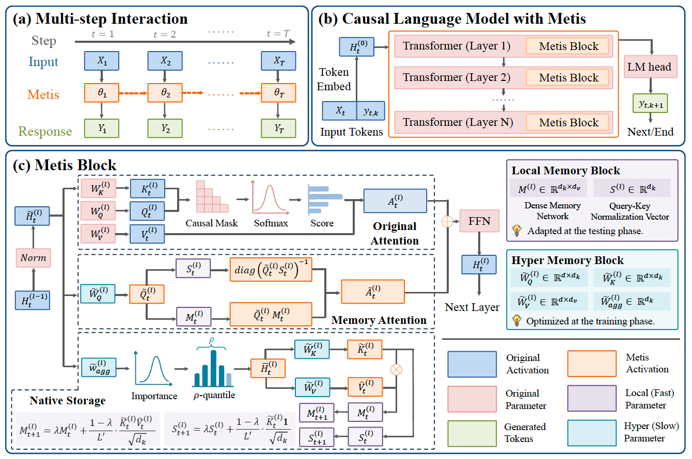

<!--  -->

<!--  -->

      <button class="refresh-btn" onclick="refreshPage()">Refresh</button>
      
Refresh for Updates

<!-- <button class="refresh-btn" onclick="refreshPage()" height="50px">Refresh</button>
Click to refresh the page
 -->

 

Hi! Thanks for visiting my homepage!  

I am Yushen Wang, an incoming Master student at [**Shanghai Jiao Tong University**](https://www.sjtu.edu.cn/). I received my Bachelor of Engineering (B.Eng.) degree in *Communication Engineering* at [**University of Electronic Science and Technology of China (UESTC)**](https://www.uestc.edu.cn/) in June 2026. I am interested in broad areas related to LLMs and have been constantly exploring emerging topics.

My current research focuses on **memory-augmented LLMs**. Feel free to contact me if necessary!   

<b><a href="/files/CV_YushenWang.pdf" >Download Full CV</a></b>

<h2 id="research-interests">🔬 Research Interests</h2>

- 🤖 **Memory foundation models**: how to internalize native memory capability to foundation models?

	

- 🧠 **LLM reasoning**: how to facilitate logical reasoning of LLMs?

- 📹 **Image processing and video streaming**: e.g., efficient and lossless video compression

<h2 id="publications">📚 Publications</h2>

Only list selected publications. <a href="/publications/">[Click here to see more details]</a>

### Journals

<ol class="publications">


	
	

	[{{ sorted_pubs.size | minus: forloop.index | plus: 1  }}]
	
	
		
			<strong>{{ author }}</strong>, 
		
			<i>{{ author }}*</i>, 
		
		  	{{ author }}, 
		
	
	, "{{ pub.title }}", <i>{{ pub.venue }}</i>, vol. {{ pub.vol }}, no. {{ pub.issue }}, pp. {{ pub.pp }}, {{ pub.date | date: "%b. %Y" }}.
	
		[<a href="{{ pub.arxiv }}" target="_blank">arXiv</a>]
	
	
		[<a href="{{ pub.slidesurl }}" target="_blank">Slides</a>]
	
	
		[<a href="{{ pub.paperurl }}" target="_blank">Paper</a>]
	
	
		[<a href="{{ pub.errata }}" target="_blank">errata</a>]
	
	
		[<a href="{{ pub.codes }}" target="_blank">Codes</a>]
	
	
		
		
	
	 
  	

	

</ol>

### Conferences
<ol class="publications">


	
	

    [{{ sorted_pubs.size | minus: forloop.index | plus: 1  }}]
    
    
        
        	<strong>{{ author }}</strong>, 
		
			<i>{{ author }}*</i>, 
        
          	{{ author }}, 
        
    
    , "{{ pub.title }}",
	
		in <i>{{ pub.venue }}</i>, {{ pub.location }}, {{ pub.date | date: "%b. %Y" }}.
	
	
		[<a href="{{ pub.arxiv }}" target="_blank">arXiv</a>]
	
	
		[<a href="{{ pub.slidesurl }}" target="_blank">Slides</a>]
	
	
		[<a href="{{ pub.paperurl }}" target="_blank">Paper</a>]
	
	
		[<a href="{{ pub.codes }}" target="_blank">Codes</a>]
	
	
		
		
	
	 
  	

	

</ol>

<h2 id="honors">🎉 Honors</h2>

- <b>[2023.12]</b> Corporate Scholarship, Luzhou Laojiao
- <b>[2023.12]</b> Outstanding Student Scholarship, UESTC
- <b>[2024.12]</b> National Scholarship for Undergraduates, Chinese Ministry of Education
- <b>[2024.12]</b> Outstanding Student Scholarship, UESTC
- <b>[2025.11]</b> Outstanding Graduate of Sichuan Province, Sichuan Provincial Department of Education

<h2 id="awards">🏆 Awards</h2>
- <b>[2024.02]</b> Honorable Mention, Mathematical Contest in Modeling
- <b>[2024.05]</b> National Third Prize, National English Competition for College Students

<h2 id="services">✍️ Services</h2>

- **Peer Reviewer**, IEEE ICC Workshop'25, Montreal, Canada.

<h2 id="internship">💼 Internship</h2>

    

        
    

    

        
<strong>MemTensor</strong>

        <ul>
            <li>LLM Algorithm Intern, Jun. 2026 - Present</li>
            <li>Research focus: memory foundation models</li>
        </ul>
    

<h2 id="education">🎓 Education</h2>

    

        
    

    

        
<strong>University of Electronic Science and Technology of China</strong>

        <ul>
            <li>B.Eng. in Communication Engineering, Sept. 2022 - Jun. 2026</li>
            <li>Supervisor: <a href="https://faculty.uestc.edu.cn/meiweidong/zh_CN/index.htm">Prof. Weidong Mei</a></li>
        </ul>
    

    

        
    

    

        
<strong>Shanghai Jiao Tong University</strong>

        <ul>
            <li>M.Eng. in Information and Communication Engineering, Sept. 2026 - Jun. 2029 (expected)</li>
        </ul>
    

